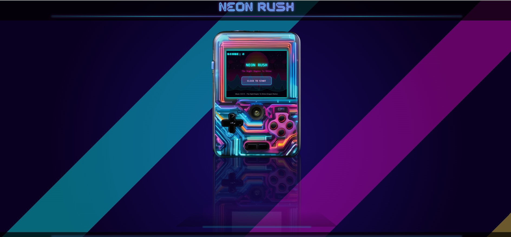
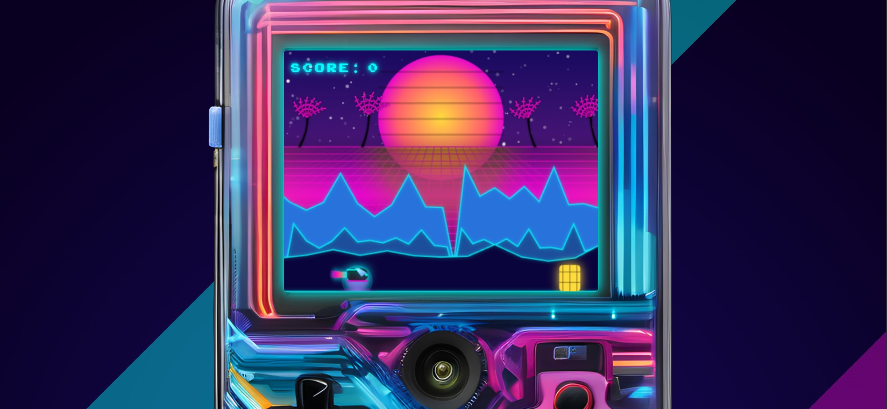

# Neon Rush 🎮



A futuristic, cyberpunk-inspired endless runner game built with pure JavaScript, HTML, and CSS. Race through a neon-filled landscape with synthwave aesthetics while avoiding obstacles and collecting points.

## 🎮 Game Preview



## 🌟 Features

- Retro-futuristic synthwave aesthetics with dynamic color transitions
- Procedurally generated obstacles with increasing difficulty
- Smooth double-jump mechanics
- Dynamic environment with mountain ranges and palm tree silhouettes
- Speed rush events with 2x point multipliers and visual transformations
- Particle effects and visual feedback
- Original soundtrack by B.E.R. - "The Night Begins To Shine (Dragon Remix)"
- Mobile-optimized version with touch controls and landscape orientation
- Interactive gaming device visualization with speaker animation effects
- Fullscreen mode for immersive gameplay on mobile devices
- Smooth animations and transitions throughout the UI
- Neon glow effects and synthwave color palette
- Responsive design that works on various screen sizes

## 🎮 How to Play

### Desktop:
- **Click** or press **Space** to jump
- Use **double jumps** to reach higher obstacles
- Avoid obstacles to earn points
- Every 50 points triggers a Speed Rush with 2x points and visual transformation
- Try to achieve the highest score possible!

### Mobile:
- **Tap** the screen to jump
- **Rotate** your device to landscape orientation for optimal gameplay
- Experience immersive fullscreen mode
- Same exciting gameplay with touch-optimized controls

## 🎯 Game Mechanics

- Progressive difficulty scaling
- Dynamic speed increases during rush mode
- Visual feedback for all player actions
- Smooth color transitions during speed rush events
- Particle effects for impacts and jumps
- Automatic device detection and redirection to appropriate version

## 🚀 Getting Started

1. Play directly at: [Neon Rush Game](https://neon-rush-game.vercel.app/)

Or run locally:

1. Clone the repository:
   ```
   git clone https://github.com/Gcavazo1/neon-rush--game.git
   ```

2. Open `index.html` in your browser

3. Enjoy the game!

## 🛠️ Technology Stack

- HTML5 Canvas for game rendering
- CSS3 with modern animations and effects
- Vanilla JavaScript (ES6+)
- Responsive design for both desktop and mobile devices
- Mobile-specific optimizations
- Vercel for deployment

## 🔮 Future Plans

- User account system
- Global high score leaderboard
- Additional power-ups and obstacles
- New game modes and challenges
- Multi-device progress synchronization

## 🤝 Contributing

Contributions, issues, and feature requests are welcome! Feel free to check the [issues page](https://github.com/Gcavazo1/neon-rush--game/issues).

## 📝 License

This project is [MIT](LICENSE) licensed.

## 🎵 Credits

- Music: B.E.R. - "The Night Begins To Shine (Dragon Remix)"
- Game Design & Development: [Gcavazo1](https://github.com/Gcavazo1) 